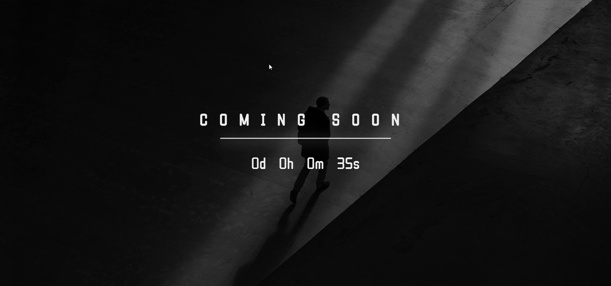
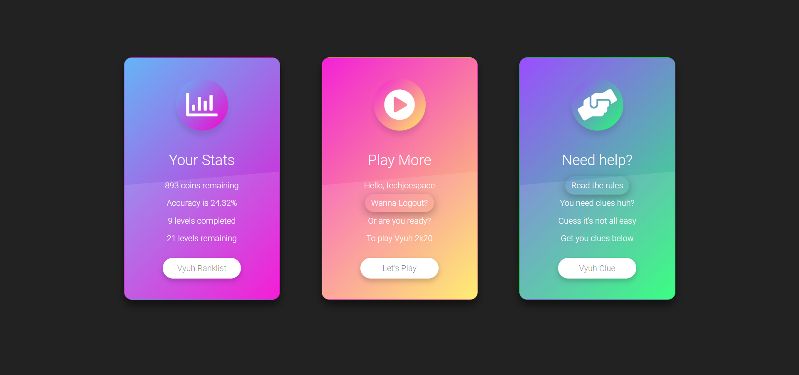
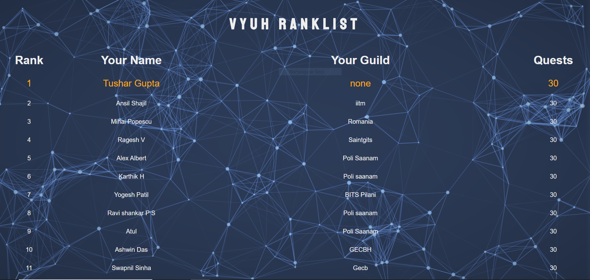
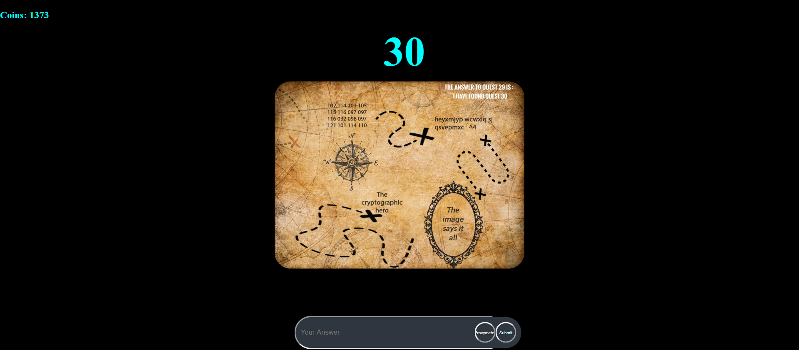
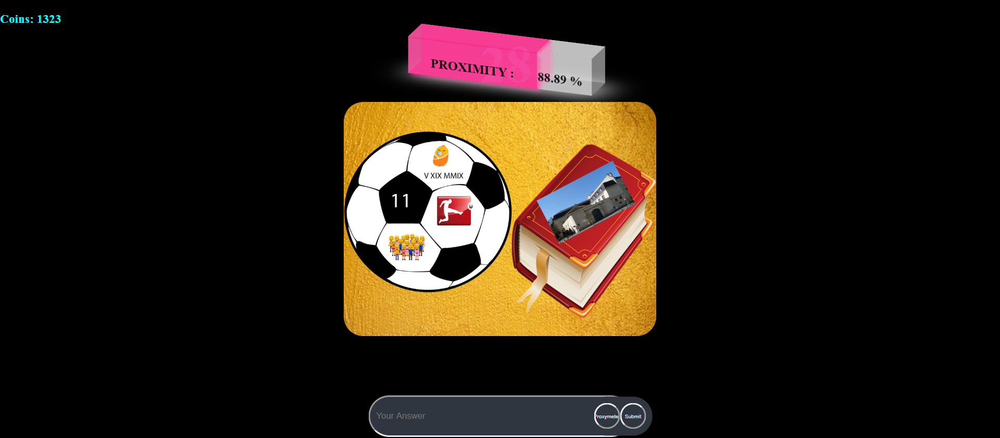
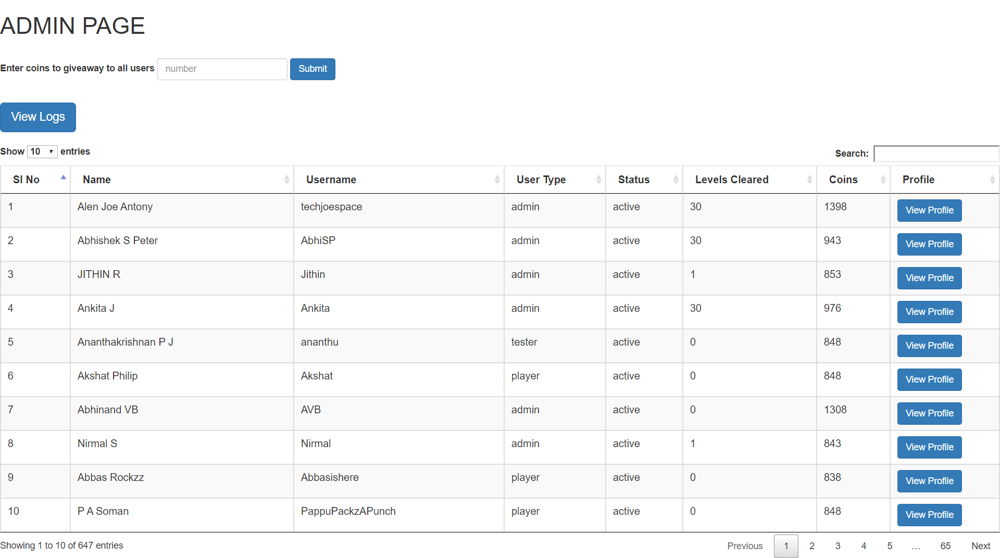
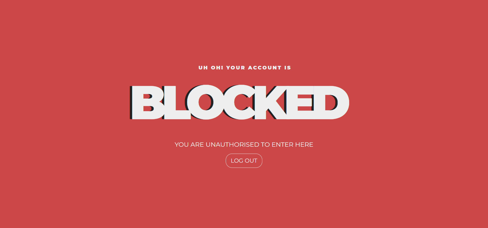
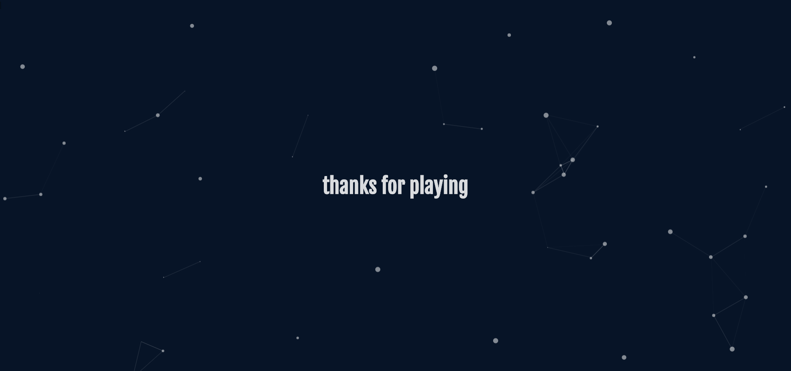

# VYUH 2020


## Discription

VYUH 2020 is the 9<sup>th</sup> edition of  the international online treassure hunt competition organised by [Government Engineering College Barton Hill](http://www.gecbh.ac.in/) in association with their techno-cultural fest  Aagneya.


##  Built With

<p align="center">
<a href="https://laravel.com/">

</a>
&nbsp&nbsp&nbsp&nbsp&nbsp&nbsp&nbsp&nbsp&nbsp&nbsp&nbsp&nbsp
<a href="https://github.com/laravel/socialite">

</a>
</p>

## Local Development

```bash
# Clone this repository 
$ git clone https://github.com/techjoespace/aagneya-vyuh-9-private
$ cd aagneya-vyuh-9-private

# Install dependencies
$ composer install

# Edit the .env file
$ cp .env.example .env
$ nano .env

# Generate new key
$ php artisan key:generate

# Start the application
$ php artisan serve --host=localhost --port=8080
```

## Screenshots

  
  
  


## Credis

#### Technical Support

- [Sreenath B S](https://github.com/sreenathbs) - For mentoring and guidance throughout the project
- Jithin R and Karun - For developing the frontend
- Abhiskek S Peter - Help with testing and prioritizing features


#### Non Technical Support

For developing questions for the event
- Abhishek S Peter
- Arunlal J
- Jithin R
- Ankita
- Abhinand V B
- [Aloysious Benoy](https://github.com/aloysiousBenoy)


## TODO
* [ ] Implement caching username and level details
* [ ] Auto post discussion boards to FB page
* [ ] Modify frontend
    * [ ] Make pages responsive
    * [ ] Apply theme and stylig to Admin page
* [ ] Modify inefficient functions 
* [ ] Pretty print the code

## License

This work is licensed under the terms of [GNU General Public License V3](https://github.com/techjoespace/aagneya-vyuh-9-private/blob/master/LICENSE.md)

Question images are subject to copyright by their respective authors. See section [Non Technical Support](#non-technical-support). 
